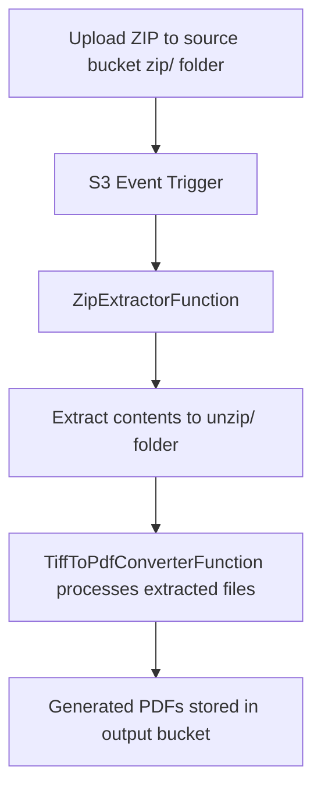

# TiffToPdfConverter - Refactored Architecture

## Overview

The TiffToPdfConverter project has been refactored to implement a modern S3-based architecture with automatic zip file processing capabilities. The system now supports both legacy local file processing and new cloud-native S3-based workflows.

## New Architecture

### Components

1. **Source S3 Bucket** - Contains two main folders:
   - `zip/` - Upload location for zip files
   - `unzip/` - Automatic extraction destination

2. **ZipExtractorFunction** - Lambda function for automatic zip extraction
3. **TiffToPdfConverterFunction** - Enhanced with S3 support for processing extracted files
4. **Output S3 Bucket** - Destination for generated PDF files

### Workflow



## Infrastructure

### S3 Buckets

- **SourceBucket**: Main bucket with automatic Lambda triggering
  - `zip/` folder: Upload zip files here
  - `unzip/` folder: Automatically populated with extracted content
- **OutputBucket**: Stores generated PDF files with encryption

### Lambda Functions

#### ZipExtractorFunction
- **Trigger**: S3 ObjectCreated events on `zip/*.zip` files
- **Runtime**: .NET 8
- **Memory**: 512 MB
- **Timeout**: 5 minutes
- **Purpose**: Automatically extracts zip files and stores contents in `unzip/` folder

#### TiffToPdfConverterFunction
- **Trigger**: API Gateway (manual invocation)
- **Runtime**: .NET 8
- **Memory**: 256 MB
- **Timeout**: 15 minutes
- **Purpose**: Processes TIFF files and generates merged PDFs
- **Modes**: 
  - Legacy local file processing
  - New S3-based processing

## Usage

### S3-Based Processing (Recommended)

1. **Upload zip file** to the source bucket's `zip/` folder
2. **ZipExtractorFunction automatically triggers** and extracts contents to `unzip/`
3. **Invoke TiffToPdfConverterFunction** with S3 parameters:

```json
{
    "useS3": true,
    "s3Path": "source-bucket-name/unzip/your-extracted-folder",
    "path": ""
}
```

### Legacy Local Processing

For backwards compatibility, the original local file processing is still supported:

```json
{
    "path": "Start",
    "useS3": false
}
```

## API Usage Examples

### S3-Based Processing
```bash
curl -X PUT https://your-api-gateway-url/Prod/processcsv \
  -H "Content-Type: application/json" \
  -d '{
    "useS3": true,
    "s3Path": "my-source-bucket/unzip/extracted-files",
    "path": ""
  }'
```

### Local Processing (Legacy)
```bash
curl -X PUT https://your-api-gateway-url/Prod/processcsv \
  -H "Content-Type: application/json" \
  -d '{
    "path": "Start",
    "useS3": false
  }'
```

## Environment Variables

### ZipExtractorFunction
- `SOURCE_BUCKET`: Name of the source S3 bucket

### TiffToPdfConverterFunction
- `SOURCE_BUCKET`: Name of the source S3 bucket (for S3 mode)
- `OUTPUT_BUCKET`: Name of the output S3 bucket
- `OUTPUT_PREFIX`: Prefix for generated PDF files (default: "pdf")

## Deployment

### Prerequisites
- AWS CLI configured
- SAM CLI installed
- .NET 8 SDK

### Deploy the Stack
```bash
sam build
sam deploy --guided
```

### Post-Deployment Steps
1. Note the output bucket names from the CloudFormation outputs
2. Upload your TIFF files in a zip archive to the source bucket's `zip/` folder
3. The system will automatically extract and process the files

## File Structure

```
TiftoPdfConverterSam/
├── src/
│   ├── TiffToPdfConverter/           # Enhanced PDF converter function
│   └── ZipExtractorFunction/         # New zip extraction function
├── test/
│   ├── TiffToPdfConverter.Test/      # Tests for PDF converter
│   └── ZipExtractorFunction.Test/    # Tests for zip extractor
├── template.yaml                     # SAM template with new infrastructure
└── README-Refactored.md             # This file
```

## Benefits of Refactored Architecture

1. **Scalability**: Cloud-native S3-based processing
2. **Automation**: Automatic zip file extraction
3. **Reliability**: Event-driven architecture with built-in retry mechanisms
4. **Security**: Encrypted S3 storage and secure Lambda execution
5. **Monitoring**: CloudWatch integration for logging and metrics
6. **Backwards Compatibility**: Legacy local processing still supported

## Migration Guide

For existing users:
1. The legacy API still works exactly as before
2. To use new S3 features, update your API calls to include `"useS3": true`
3. Upload files to the new S3 buckets instead of packaging them locally

## Security

- All S3 buckets use AES-256 encryption
- Public access is blocked on all buckets
- Lambda functions have minimal required IAM permissions
- Network traffic is secured through VPC when needed

## Monitoring and Troubleshooting

- Check CloudWatch logs for both Lambda functions
- Monitor S3 bucket metrics for upload/download patterns
- Use AWS X-Ray for distributed tracing (enabled by default)

## Cost Optimization

- Lambda functions are configured with appropriate memory and timeout settings
- S3 storage classes can be configured for cost optimization
- Evaluation mode limits (4 pages per PDF) help control processing costs